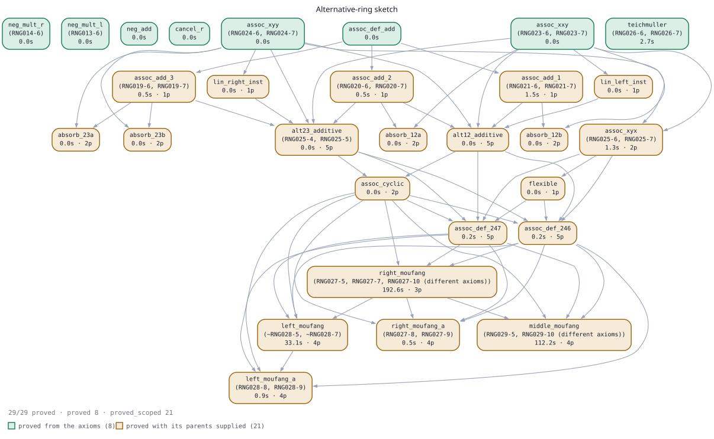

# Sketches attempted, and how to refine the failed ones

A catalogue of every proof sketch this project has actually run, what each was
made of, what it achieved, and — for the alternative-ring library, which is the
live one — a concrete refinement plan grounded in the traces.

Design rationale is in [SKETCH_LOOP.md](SKETCH_LOOP.md); measured results are in
[FINDINGS.md](FINDINGS.md). This file is the middle layer: what we asked the
prover to believe, and why it did or did not help.



Regenerate with `./scripts/blueprint.py` (add `--watch` to redraw while a
verification run is in flight). Node colour is proof status, edges are
dependencies; a node with no edges at all is a lemma nothing in the sketch
depends on.

## What counts as a sketch here

A sketch is an ordered list of equations meant to lie on the intended proof.
It reaches twee through one of three channels, which are **not**
interchangeable:

| channel | mechanism | measured cost |
|---|---|---|
| **hints** | `$hint(t)` reweights `CP.score` when a critical pair already contains `t` | no gradient — a discount on arrival only |
| **axioms** | full participation in completion | forms critical pairs with every rule; 20 lemmas as axioms timed out where the same as hints proved in 173.6s |
| **goals** (rungs) | each equation becomes its own conjecture | supplies direction for free; rung proofs are then promotable as hints |

Everything below is one of these three, or a combination.

---

## S1 — Donor-chain hints, 8 problems (v0)

**Source of the sketch.** No model. For each resisted target, find the
most axiom-similar *solved* sibling, take its proof's intermediate rewrite-chain
terms, rank by occurrence count, cap at 25.

**Result: 1 flip in 8.**

| problem | hinted, both directions | baseline |
|---|---|---|
| **MVA005-1** | **Unsatisfiable 546.8s** (`--no-flatten-goal`) | Timeout at 1000s and 4000s |
| COL003-1, GRP673-10, GRP674-11, KLE096-10, LAT138-1, LCL054-10, LCL231-10 | Timeout ~1002s both directions | Timeout |

**What it taught us.** The MVA005-1 ablation split the 25 hints by specificity
and ran each half alone:

| arm | result |
|---|---|
| 13 specific (waypoints) alone | **Unsatisfiable 852.9s** |
| 12 generic (accelerants) alone | Timeout 1001.6s |
| all 25 together | Unsatisfiable 546.8s |

So the two halves do different jobs: waypoints carry the proof, accelerants only
make an already-working search faster. The cap of 25 admitted 13 waypoints **by
luck** — ranking is by occurrence count, which favours accelerants, so a tighter
cap would have kept only the half that cannot prove anything.

Artifacts: `examples/sketch_loop/*/` (problem, sketch, hints, hinted input,
result), ablation in `examples/sketch_loop/MVA005-1/ablation/`.

---

## S2 — MVA005-1 as a ladder

**Source.** The same donor proof, but its `Lemma N: lhs = rhs` lines instead of
its rewrite-chain terms — equations can be goals, chain states cannot. 20 rungs
after alpha-normalisation.

**Result.** The decomposition was never the problem; *how the rungs were run*
was, twice over:

| how rungs are verified | outcome |
|---|---|
| chained (each rung gets the previous lemmas as axioms) | 324.9s, 19/20 proven |
| **standalone** (each rung from the problem's own axioms) | **94.3s, 20/20**, and parallelisable |

| how rungs are promoted | outcome |
|---|---|
| 20 lemmas as axioms | Timeout 1001.7s |
| **the same as hints** | **173.6s** |

On the deterministic build, every arm side by side:

| arm | cpu |
|---|---|
| no hints | 317.2s |
| flat 25 hints | 408.3s — **worse than no hints** |
| ladder, chained | 463.9s |
| **standalone skeleton** | **258.5s** |

**Caveat carried forward.** That 94.3s / 20-of-20 was measured in a single goal
direction, and the ladder is not a closed sub-DAG — the 19 promoted lemmas need
a 179-lemma ancestor closure, so 160 parents are absent. Both are open.

---

## S3 — Drafting without a donor: the alternative-ring library

This is the live sketch. RNG029-5 (middle Moufang identity, rating 0.96) resists
at 4000s in both directions and its domain has essentially no donor material — 1
saved RNG proof against 13 resisted RNG problems, no Veroff coverage. So the
sketch had to be **drafted**, along the classical route: associator is
trilinear, hence alternating, hence the flexible law, hence Moufang.

11 of the 13 resisted RNG problems share `Axioms/RNG003-0.ax`, so one library
serves all of them.

### Iterations

| iter | library | how run | result |
|---|---|---|---|
| 1 | 11 lemmas | standalone, 120s, **single direction** | 7 verified (all accelerants); attempt with 10 hints timed out at 1200s both directions |
| 2 | + trilinearity, + linearised instances | standalone, **single direction** | the three trilinearity lemmas recorded as failures — later shown to be a direction artifact |
| 3 | 19 lemmas | standalone, 300s, **both directions**; attempt at 4000s both directions | **13 verified**; 1 flip in 10 targets |

Iteration 2's conclusion was wrong, and wrong in a way worth recording: on a
single-direction trace, `assoc_add_1` derived 3862 rules and touched the goal's
Skolem constants **zero times**; under `--flatten-goal` it proved in 30.5s with
1565 rules touching the goal. I had concluded from the failure that the
mathematical subdivision was wrong. It was not — the execution was.

### Iteration 3, lemma by lemma

Verification is against the problem's own axioms, no hints, 300s per direction.

| lemma | statement | `--flatten` | `--no-flatten` |
|---|---|---|---|
| `neg_mult_r` | `x·(−y) = −(xy)` | 0.0s | 0.0s |
| `neg_mult_l` | `(−x)·y = −(xy)` | 0.0s | 0.0s |
| `neg_add` | `−(x+y) = −x + −y` | 0.0s | 0.0s |
| `cancel_r` | `(x+y)+(−y) = x` | 0.0s | 0.0s |
| `assoc_xxy` | `(x,x,y) = 0` | 0.0s | 0.0s |
| `assoc_xyy` | `(x,y,y) = 0` | 0.0s | 0.0s |
| `assoc_xyx` | `(x,y,x) = 0` | 1.5s | 1.5s |
| `flexible` | `(xy)x = x(yx)` | 3.4s | 1.4s |
| `lin_left_inst` | `(x+y, x+y, z) = 0` | 0.0s | 0.0s |
| `lin_right_inst` | `(x, y+z, y+z) = 0` | 0.0s | 0.0s |
| `assoc_add_1` | `(x+y, z, w) = (x,z,w) + (y,z,w)` | **30.5s** | timeout |
| `assoc_add_2` | `(x, y+z, w) = (x,y,w) + (x,z,w)` | **1.7s** | timeout |
| `assoc_add_3` | `(x, y, z+w) = (x,y,z) + (x,y,w)` | **1.7s** | timeout |
| `alt12_additive` | `(x,y,z) + (y,x,z) = 0` | timeout | timeout |
| `alt23_additive` | `(x,y,z) + (x,z,y) = 0` | timeout | timeout |
| `assoc_alt_12` | `(x,y,z) = −(y,x,z)` | timeout | timeout |
| `assoc_alt_23` | `(x,y,z) = −(x,z,y)` | timeout | timeout |
| `left_moufang` | `((xy)x)z = x(y(xz))` | timeout | timeout |
| `right_moufang` | `z((xy)x) = ((zx)y)x` | timeout | timeout |

13/19 verified. Attempt: 10 targets × 2 directions × 19 hints × 4000s →
**RNG025-5 Unsatisfiable at 2484s** (`--no-flatten-goal`), everything else
timing out at ~4004s.

**Attribution settled.** The attempt changed two things against the baseline —
hints *and* a move from the stock to the deterministic build — so the missing arm
was run. No hints, deterministic build, 4000s: RNG025-5 **Timeout 4003.4s /
4003.9s**, RNG029-5 Timeout in both directions. The flip belongs to the hint
library, not to the build. It is the first flip here from a drafted, non-donor
sketch.

Two things keep it modest: RNG025-5 is rated 0.74, so it is a flip over our own
baseline rather than an ATP first; and its conjecture is `alt23_additive`, one of
the library's own unverified lemmas, so the library mainly proved its own missing
rung.

---

## Where these problems actually sit (TPTP ground truth)

Checked against the local TPTP v9.2.1 headers rather than assumed.

**None of the ten targets is open.** All carry `Status: Unsatisfiable` — known
theorems. The Moufang identities in alternative rings are classical
(Bruck–Kleinfeld 1951; Schafer's textbook, ch. III); Stevens (1987, 1988) posed
them as ATP challenges, which is why they are in TPTP at all. So this line of
work is about ATP capability, not about settling mathematics.

**Three of our drafted lemmas are TPTP problems in their own right**, and their
ratings match how they behaved for us:

| our lemma | TPTP problem | rating | our verification |
|---|---|---|---|
| `assoc_add_1` | RNG021-6/7 | 0.35 | 30.5s |
| `assoc_add_2` | RNG020-6/7 | 0.22–0.35 | 1.7s |
| `assoc_add_3` | RNG019-6/7 | 0.30–0.35 | 1.7s |
| `alt23_additive` | **RNG025-4/-5** | 0.74–0.83 | timeout at 300s |
| Teichmüller (R3 below) | **RNG026-6/-7** | 0.30–0.39 | not yet tried |

R3 is therefore not a speculative bridge: it is an existing TPTP problem of
moderate difficulty, and the field solves it.

**The ratings of the targets**, current version:

| rating | problems |
|---|---|
| 0.74 | RNG025-5 |
| 0.91 | RNG027-8, RNG027-9, RNG028-9 |
| 0.96 | RNG027-5, RNG027-7, RNG028-5, RNG028-7, RNG028-8, RNG029-5, RNG029-6, RNG029-7 |
| **1.00** | **RNG027-10, RNG029-10** |

Rating is the fraction of state-of-the-art systems that *fail* at TPTP's
evaluation limit (a few hundred seconds), so 1.00 means no current system solves
it under competition conditions — not that no proof exists.

### The baseline screen already solved three of these

From `logs/screen4000/`, no hints, stock build, `--no-flatten-goal`:

| problem | rating | cpu |
|---|---|---|
| **RNG027-10** | **1.00** | 3271.1s |
| RNG027-5 | 0.96 | 3555.6s |
| RNG028-5 | 0.96 | 3825.8s |

All three land in the last 20% of a 4000s budget, which is why the ratings say
what they say: at competition limits these are out of reach, and the honest
description is *budget*, not capability. But it does mean the plain prover, with
no sketch at all, is the strongest result this project has on the RNG frontier —
stronger than the hinted RNG025-5 flip.

### The genuinely open ones

Eight UEQ RNG problems carry `Status: Unknown` — no proof and no countermodel
recorded. All rated 1.00.

| problem | statement | mathematical status |
|---|---|---|
| RNG010-5/6/7 | the three Moufang identities imply skew symmetry of `s(w,x,y,z) = (wx,y,z) − x(w,y,z) − (x,y,z)w` | CADE-11 competition problem Eq-9; **the Moufang hypotheses were stated wrongly until the v2.3.0 bugfix**, so pre-1993 competition results do not transfer to the current file |
| RNG033-6/7/8/9 | `(xy,z,w) + (x,y,[z,w]) = x(y,z,w) + (x,z,w)y` | Stevens (1987) challenge problem; no proof recorded |
| RNG036-7 | `x⁵ = x ⟹ commutative` | **known mathematically** — Jacobson's theorem gives `xⁿ = x ⟹ commutative` for all n — but the standard proof is structural (subdirect decomposition, Wedderburn), not equational. An *equational* proof is what is missing |

RNG036-7 has the cleanest frontier structure in the whole corpus: `x³ = x` is
RNG009-5/7 at rating 0.43–0.48, `x⁴ = x` is RNG035-7 at 0.65 and solved, `x⁵ = x`
is unsolved. A graded family with a known-true, never-mechanised top rung.

RNG010-5 is the best fit for the current library: it takes the three Moufang
identities as *hypotheses*, so it sits directly downstream of everything the
drafted library is trying to establish.

### TPTP ran the axioms-vs-hints experiment for us

RNG025-4 and RNG025-5 have the **same conjecture and the same axiom include**.
RNG025-5 adds seven inline axioms — and they are exactly the sign lemmas our
library drafted:

```
multiply(additive_inverse(X), Y)  = additive_inverse(multiply(X, Y))
multiply(X, additive_inverse(Y))  = additive_inverse(multiply(X, Y))
multiply(additive_inverse(X), additive_inverse(Y)) = multiply(X, Y)
  ... plus four distributivity-with-inverse variants
```

Same screen, same build, same budget, same direction:

| problem | 1000s `--flatten-goal` |
|---|---|
| RNG025-4 (without the seven) | **Unsatisfiable 371.9s** |
| RNG025-5 (with the seven as axioms) | Timeout — and still Timeout at 4000s |

Seven true, relevant, useful lemmas, added as axioms, turned a 372s proof into a
>4000s failure. That is the strongest evidence yet for the axioms-vs-hints
finding, and we did not construct it — TPTP shipped the pair. The same lemmas as
*hints* proved RNG025-5 in 2484s.

Note the field disagrees about which is harder: RNG025-4 is rated 0.83 and
RNG025-5 is 0.74, so for most systems the extra axioms help. The penalty is
specific to completion-based provers, or to our configuration.

This also deflates the overnight flip further. RNG025-5's content was already
proved, faster, in its RNG025-4 encoding, and we never used that saved proof
(`logs/screen/proofs/RNG025-4_flatten-goal.out`) as donor material — which it is.

## Diagnosis: three structural faults, all visible in the traces

### 1. The library has no rungs where the problem is

The ten targets are not ten independent theorems. Their goals:

| problem | goal |
|---|---|
| RNG025-5 | `(x,y,z) + (x,z,y) = 0` — **this is `alt23_additive`, a library lemma** |
| RNG027-8/9 | `(x, xy, z) = (x,y,z)·x` — right Moufang, associator form |
| RNG027-7 | `z(x(yx)) = ((zx)y)x` — right Moufang, product form |
| RNG028-8/9 | `(x, yx, z) = x·(x,y,z)` — left Moufang, associator form |
| RNG028-7 | `(x(yx))z = x(y(xz))` — left Moufang, product form |
| RNG029-5/6/7 | `(xy)(zx) = x((yz)x)` — middle Moufang |

So the library's top two rungs, `left_moufang` and `right_moufang`, **are the
target theorems**. Between "associator is trilinear" (verified, cheap) and
"Moufang" (the goal) the sketch drafted exactly one step — the alternating law —
and it failed. There is no bridge. A sketch whose hardest step is the conjecture
itself is not a decomposition.

### 2. Standalone verification denies each rung its parents

Standalone-by-default was measured on the S2 donor ladder, where every rung came
from a real proof and was therefore reachable from the axioms directly. A
*drafted* rung is drafted precisely because it is not.

`alt12_additive` follows in four rewrite steps from lemmas we already verified:

```
(x+y, x+y, z) = 0                                   lin_left_inst   ✓ 0.0s
              = (x, x+y, z) + (y, x+y, z)           assoc_add_1     ✓ 30.5s
              = [(x,x,z) + (x,y,z)] + [(y,x,z) + (y,y,z)]   assoc_add_2  ✓ 1.7s
              = (x,y,z) + (y,x,z)                   assoc_xxy, assoc_xyy  ✓ 0.0s
```

Every ingredient verified. The rung still timed out at 300s — because
standalone verification gave it none of them. This is exactly the
A-needed-for-B-not-C question: the answer is that scope must follow the
dependency DAG, not a global policy.

### 3. Two of the failed statements are badly oriented

`assoc_alt_12` and `assoc_alt_23` are stated as `(x,y,z) = −(y,x,z)`. Applying
such an equation twice returns to the start modulo double negation — a poor
rewrite rule. The additive forms `(x,y,z) + (y,x,z) = 0` are strictly better
behaved, and note that TPTP itself states RNG025-5 additively. Drop the negated
forms; keep only the additive ones.

### 4. 300s was too short to call a verification failed

RNG025-5 — i.e. `alt23_additive` — **is provable**: it took 2484s. Our
verification budget was 300s. So at least one "unverified" lemma was simply
under-budgeted, and the library's verified/failed split partly measures budget
rather than mathematics.

---

## Refinement plan

Ordered by cost. R1–R3 are cheap and test the diagnosis directly.

### R1 — Verify with direct parents, not standalone — **run, confirmed**

Result in FINDINGS ("Context scope decides the drafted rungs"). 20 jobs, 600s,
deterministic build:

| lemma | scope | as axioms | as hints |
|---|---|---|---|
| `alt12_additive` | none | 592.5s / Timeout | — |
| | **direct parents (5)** | **0.2s / 0.0s** | Timeout / Timeout |
| | all 13 verified | 0.1s / 0.0s | Timeout / Timeout |
| `alt23_additive` | none | 415.4s / Timeout | — |
| | **direct parents (5)** | **0.1s / 0.0s** | 483.1s / Timeout |
| | all 13 verified | 0.1s / 0.1s | 194.5s / Timeout |

(`--flatten-goal` / `--no-flatten-goal`)

The prediction held at ~3000–4000x. Three consequences beyond it:

1. **Direct parents suffice** — 5 lemmas match 13. Scope follows the parents, not
   the ancestor closure. That is the queued context-scope question, answered.
2. **Axioms beat hints here, inverting MVA005-1.** The promotion rule is
   size-and-precision dependent: a small exact parent set wants axioms, a large
   approximate set wants hints. `agent/ladder.py`'s unconditional
   `promote="hints"` is wrong for the first case.
3. **Budget was a second, separable cause** — both lemmas need 415–593s
   standalone, above the 300s used overnight. The `none` control arms are the
   only reason this is not misattributed entirely to scope.

The original R1 rationale follows.


Give each failed rung its DAG parents as **axioms** (few enough that the
accumulation penalty is small), rather than the empty context:

| rung | parents to supply |
|---|---|
| `alt12_additive` | `lin_left_inst`, `assoc_add_1`, `assoc_add_2`, `assoc_xxy`, `assoc_xyy` |
| `alt23_additive` | `lin_right_inst`, `assoc_add_2`, `assoc_add_3`, `assoc_xyy`, `assoc_xxy` |

**Prediction, and it is falsifiable:** `alt12_additive` drops from >300s to
seconds. If it does not, the trilinear lemmas are not actually the route twee
takes and the whole classical decomposition is the wrong sketch for this prover.

This is also the long-queued context-scope experiment (standalone vs direct
parents vs full ancestor closure) — the drafted library is a better test bed for
it than the donor ladder, because here the dependencies are known by
construction rather than reverse-engineered from citations.

### R2 — Insert the absorption rungs the prover found on its own

The winning RNG025-5 proof contains 41 lemmas. Two of them are exactly the
intermediate shape the subdivision above predicts:

```
Lemma 48.  (x, y, y+z) = (x, y, z)
Lemma 49.  (x, y, z+y) = (x, y, z)
```

That is "absorb a repeated argument out of a sum" — one linearisation step,
smaller than the full alternating law. twee reached them unaided but only deep
into a 2484s run. Drafting them as rungs is a cheap, evidence-backed insertion,
and the same shape in the other argument pairs gives the missing intermediate
layer.

### R3 — Bridge to Moufang with the Teichmüller identity

The gap identified in fault 1 has a standard filler:

```
(wx, y, z) − (w, xy, z) + (w, x, yz) = w·(x,y,z) + (w,x,y)·z
```

It holds in **any** ring — it is pure expansion of the associator definition,
needing only distributivity and additive associativity, no alternativity. It is
also **TPTP RNG026-6/-7, rated 0.30–0.39**, so the field solves it routinely and
it should verify for us. It is the classical tool for getting from "associator
alternating" to the Moufang identities. Add it, plus the associator-form Moufang
statements as rungs below the product forms:

```
right Moufang:  (x, xy, z) = (x,y,z)·x      → then z((xy)x) = ((zx)y)x
left  Moufang:  (x, yx, z) = x·(x,y,z)      → then ((xy)x)z = x(y(xz))
middle Moufang: from left + right
```

### R4 — Treat the ten targets as a DAG, and use RNG025-5 as the donor

The targets stand in derivability order, and the associator forms
(RNG027-8/9, RNG028-8/9) sit strictly below the product forms
(RNG027-7, RNG028-7) which sit below middle Moufang (RNG029-5/6/7). Running
them as ten independent 4000s jobs discards that ordering entirely.

And this is no longer a no-donor theory. Two proofs over `RNG003-0.ax` are
already saved and unused:

- `logs/screen/proofs/RNG025-4_flatten-goal.out` — 371.9s, the *easy* encoding of
  `alt23_additive`, sitting in the screen output the whole time;
- `logs/overnight/attempt/RNG025-5.no-flatten-goal.out` — 41 lemmas.

Plus `RNG027-5`, `RNG027-10` and `RNG028-5`, all Moufang, all proved by the
plain 4000s screen. Feed all of them through the existing donor path
(`agent/donors.py` → `agent/hints.py`) alongside the drafted library. The
"drafting without a donor" framing was true when the library was written and is
no longer true.

### R7 — Point the machinery at the problems that are actually open

Everything above targets known theorems. The eight `Status: Unknown` UEQ RNG
problems are where a result would settle something:

1. **RNG010-5/6/7** — takes the three Moufang identities as hypotheses, so it is
   directly downstream of the current library and needs no new theory. Best
   first target.
2. **RNG036-7** (`x⁵ = x ⟹ commutative`) — known true by Jacobson's theorem, no
   equational proof recorded, and it sits on top of a graded family
   (`x³` rated 0.43, `x⁴` rated 0.65 and solved). A sketch for it can be *mined*
   from the x³ and x⁴ proofs rather than drafted, which is the retrieval mode
   the loop already implements.
3. **RNG033-6/7/8/9** — Stevens' challenge; no scaffolding available, drafting
   only.

None of these has been run here at any budget. That is the gap.

### R5 — Verification budget and direction discipline

- Verify at **both** directions always — now the default, but it is what
  invalidated iteration 2's conclusion and belongs in the harness, not in a
  script.
- Re-verify the failed structural lemmas at **1200–2500s**, not 300s.
  `alt23_additive` needs ~2484s unaided; a 300s failure says nothing.
- Report per-rung *inert hint counts* so a failed rung distinguishes "bad
  sketch" from "sketch never reached the search".

### R6 — Mechanism fixes (separate track, not sketch content)

- **Hint cost inversion** (`Twee.hs:618`): cost grows with function-symbol
  count, so waypoints — the load-bearing hints — get the *smallest* discount and
  accelerants the largest. Two hint channels with independent factors.
- **No gradient toward a waypoint** (`Index.matches` in `CP.score`): partial
  credit proportional to how much of a waypoint's structure is present.

## Order to run

1. ~~R1~~ **done** — the classical decomposition is right; scope was the fault.
   Follow-on code change, not yet made: `agent/ladder.py` needs a
   `verify="parents"` scope and a promotion rule keyed on set size, since its
   current unconditional `promote="hints"` is wrong for small exact parent sets.
2. R2 absorption rungs, 300s — cheap, and expected to verify.
3. R3 Teichmüller, 300s — expected to verify; it needs no alternativity.
4. Only then re-attempt the targets, in DAG order, with the enlarged library
   plus the mined lemmas from the four saved RNG proofs.
5. In parallel and independent of all of the above: a plain 4000s both-direction
   baseline on the eight `Status: Unknown` RNG problems. They have never been run
   here, the plain baseline is what solved RNG027-10, and it costs nothing but
   machine time.

Blocking item: the no-hint deterministic control on RNG025-5 and RNG029-5. If it
proves RNG025-5 without hints, the one flip belongs to the build, the drafted
library scores 0/10, and R1–R3 become the whole of the evidence for continuing
this line rather than a refinement of a positive result.
